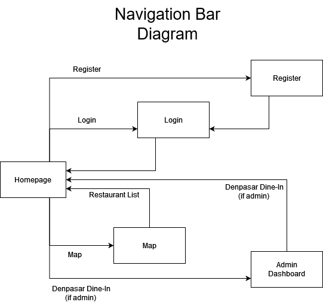

# denpasar-food
## Group members
- Derensh Pandian		
- Isaac Jesse Boentoro		
- Donia Sakji		
- Ferdinand Bonfilio Simamora		
- Adiena Nimeesha Adiwinastwan		
- Bryant Warrick Cai		

## Link to the APK (not required at Stage I. The APK link can be added to README.md after completing Stage II.)

Link : 
`https://install.appcenter.ms/orgs/k6-denpasar-food/apps/denpasar-food/distribution_groups/public/releases`

## Application description

Denpasar Restaurant Finder - Flutter Application

This Flutter-based mobile application enables users to discover and explore restaurants in the Denpasar area. It interfaces with a Django-based web backend to provide up-to-date restaurant information.

Features:

- Find Nearby Restaurants: Utilizes device location services to display restaurants close to the user's current position.
- Browse Restaurant Database: Offers access to a comprehensive database of restaurants in Denpasar.
- Sort and Filter Options: Allows users to sort and filter restaurants by criteria such as cuisine type, price range, and more.
- Restaurant Details: Provides detailed information about each restaurant, including menus, photos, operating hours, and contact information.
- "Restaurants Near Me" Feature: A dedicated function to list nearby dining options and view their locations on a map.

Technical Overview:

- Frontend: Developed with Flutter for a consistent user experience across Android and iOS platforms.
- Backend: Powered by a Django-based web application that manages restaurant data and handles user queries.

## List of modules to be implemented
```
restaurants
authentication
reviews
maps
admin_dashboard
navigation
```

## Roles or actors of the user application

Guest:
- Filter restaurants
- Read restaurants

Customer:
- In addition to everything a guest can do, a customer can also,
- Comment on restaurants
- Leave reviews on restaurant

Admin:
- In addition of everything a customer can do, an admin can also,
- Add/modify/delete account data from the database
- Add/modify/delete restaurant data from the database


## Integration with the Web Service to Connect to the Web Application Created in the Midterm Project

## Restaurants Module

- Fetching Restaurant Data: The application sends HTTP GET requests to retrieve a list of restaurants, including details like names, locations, cuisines, price ranges, menus, photos, operating hours, and contact information.
- Filtering and Sorting: Users can apply filters or sorting options sent as query parameters. The web service processes these and returns the filtered and sorted list.

### Endpoints Used:

- Retrieve All Restaurants: Retrieve a paginated list of all restaurants (GET /)

    Parameters:
    - page (optional): The page number for pagination.

- Retrieve Restaurants with Filters: Retrieve restaurants based on search terms and selected cuisines (GET /?search=<search_term>&search_by=<search_field>&cuisines=<cuisine1>&cuisines=<cuisine2>&...)

    Parameters:
    - search (optional): The search term entered by the user.
    - search_by (optional): Field to search by (name or cuisine). Default is name.
    - cuisines (optional): List of cuisines to filter by (can be multiple).
    - page (optional): The page number for pagination.

- Retrieve Restaurants via AJAX: Dynamically update restaurant listings without reloading the page (GET /ajax/?   search=<search_term>&search_by=<search_field>&cuisines=<cuisine1>&...)

    Parameters: Same as above.

### Details:

- RestaurantListView in restaurants/views.py handles the requests and processes query parameters.
- Pagination is managed with paginate_by = 9.

## Authentication Module

- User Registration: New users register by sending HTTP POST requests with their information.
- User Login: Users log in by sending credentials via HTTP POST. The web service authenticates the user and establishes a session.
- User Logout: Users log out, and the app notifies the web service to terminate the session.
- User Customization: Authenticated users access and update their settings.

### Endpoints Used:

- User Login: Authenticate a user and start a session (POST /auth/login/)
    
    Parameters:
    - username: The user's username.
    - password: The user's password.

- User Logout: Log out the user and end the session (POST /auth/logout/)

- User Registration: Register a new user account (POST /auth/register/)
    
    Parameters:
    - username: Desired username.
    - password1: Password.
    - password2: Password confirmation.

- User Customization (Access Settings): Retrieve user-specific data (GET /auth/customization/)

- User Customization (Update Settings): Update user customization settings (POST /auth/customization/)
    
    Parameters:
    - Depends on the customization options available.

### Details:

- Functions in authentication/views.py handle authentication processes.
- CustomUserCreationForm is used for registration.
- user_customization view allows access to personalized data.

## Reviews Module

- Submitting Reviews: Authenticated users submit reviews by sending HTTP POST requests with review content, ratings, and the restaurant ID.
- Fetching Reviews: The app retrieves reviews for a restaurant via HTTP GET requests.
- Liking/Disliking Restaurants: Users like or dislike a restaurant via POST requests.

### Endpoints Used:

- Get Restaurant Details and Reviews: Retrieve restaurant details and reviews (GET /reviews/restaurant/<int:restaurant_id>/)
    
    Parameters:
    - restaurant_id: The ID of the restaurant.

- Submit a Review: Submit a review for a restaurant (POST /reviews/restaurant/<int:restaurant_id>/add_review/)
    
    Parameters:
    - rating: The rating given by the user.
    - comment: The review text.

- Like a Restaurant: Like a restaurant (POST /reviews/restaurant/<int:restaurant_id>/like/)

- Dislike a Restaurant: Dislike a restaurant (POST /reviews/restaurant/<int:restaurant_id>/dislike/)

### Details:

- Functions in reviews/views.py handle the operations.
- Authentication is required for submitting reviews and liking/disliking.

## Maps Module

- Fetching Location Data: The app retrieves restaurant location data to display on a map.
- Displaying Restaurants on Map: Users view restaurants on an interactive map, possibly applying filters.

### Endpoints Used:

- Retrieve Map View with Restaurants: Retrieve map view with restaurants (GET /map/?search=<search_term>&search_by=<search_field>)
    
    Parameters:
    - search (optional): Search term.
    - search_by (optional): Field to search by (name).

### Details:

- RestaurantMapView in maps/views.py handles the requests.
- Restaurants are filtered within Denpasar coordinates.


## Navigation Module

- Dynamic Content Loading: Requests data to display dynamic menu options, such as the user's name or notifications.
- Session Management: Adjusts navigation options based on authentication status.

### Endpoints Used:

- User Customization: Retrieve user-specific data (GET /auth/customization/)

- Check Authentication Status: Session-based; checked internally.

### Details:

- The user_customization view provides personalized data.
- Navigation adjusts based on request.user.is_authenticated and request.user.is_superuser.



## Admin Dashboard Module

- Managing Restaurants: Admin users add, edit, or delete restaurant data via HTTP requests.
- Managing Users: Admins manage user accounts via API endpoints.

### Endpoints Used:

- Restaurant Management:

    - List All Restaurants (Admin View): List all restaurants with optional search functionality (GET /admin-dashboard/restaurants/?q=<query>)
        
        Parameters:
        - q (optional): Search term for restaurant names.

    - Add a New Restaurant: Add a new restaurant to the database (POST /admin-dashboard/restaurants/add/)
        
        Parameters:
        - Form data including required fields:
        - id, name, latitude, longitude, cuisines, website, phone, address, image_url
        - Optional fields as per the form.

    - Update Restaurant Details: Update an existing restaurant (POST /admin-dashboard/restaurants/update/<int:pk>/)
        
        Parameters:
        - pk: Primary key (ID) of the restaurant.
        - Form data for fields to update.

    - Delete a Restaurant: Delete a restaurant (POST /admin-dashboard/restaurants/delete/<int:pk>/)
        
        Parameters:
        - pk: Primary key of the restaurant.

    - Batch Delete Restaurants: Delete multiple restaurants at once (POST /admin-dashboard/delete/)
        
        Parameters:
        - restaurant_ids: List of restaurant IDs to delete.

- User Management:

    - List All Users: List all users with optional search functionality (GET /admin-dashboard/users/?q=<query>)
        
        Parameters:
        - q (optional): Search term for usernames.

    - Add a New User: Add a new user account (POST /admin-dashboard/users/add/)
        
        Parameters:
        - Form data from UserForm.

    - Update User Details: Update an existing user (POST /admin-dashboard/users/update/<int:pk>/)
        
        Parameters:
        - pk: Primary key of the user.
        - Form data for fields to update.

    - Delete a User: Delete a user account (POST /admin-dashboard/users/delete/<int:pk>/)
        
        Parameters:
        - pk: Primary key of the user.

    - Batch Delete Users: Delete multiple users at once (POST /admin-dashboard/users/delete/)
        
        Parameters:
        - user_ids: List of user IDs to delete.

### Details:

- Views in admin_dashboard/views.py handle operations.
- Admin access is enforced via @login_required and @user_passes_test(lambda u: u.is_superuser) decorators.

# Dev Notes
## Instruction for other user to start the code:

TODO: update the Dev Notes for the flutter version

NOTE: The following instructions ASSUME that your current local repo is fresh out of 
```
git clone https://github.com/K6-PBD-Midterm/denpasar_food_mobile.git
```

If you are in windows use `python`, if you're on linux/mac use `python3`

Make sure you are in the root folder when running startup code, for example:

```
for Windows
C:\Users\ferdi\OneDrive\Desktop\denpasar-food>

for Mac

```

Make sure you do the following startup code in order (except if told otherwise)

### Step 1:
Inside the root directory of this repository, run:
```
python -m venv env
```

### Step 2:
Activate the virtual environment by running:

Windows:
```
env\Scripts\activate
```

Unix (Mac/Linux):
```
source env/bin/activate
```

Note: On Windows, if you get an error that running scripts is disabled on your system, follow these steps:
1. Open Windows PowerShell as an administrator. (Search "PowerShell" on start menu, then right-click -> Run as administrator)
2. Run the following command: `Set-ExecutionPolicy Unrestricted -Force`

### Step 3: Install Tailwind

If you don't have node.js installed yet, you should install it first: see this tutorial for more information: [How to Install Node.js and NPM on Windows and Mac](https://radixweb.com/blog/installing-npm-and-nodejs-on-windows-and-mac#windows).

After that, run:
```
npm install -D tailwindcss
```

### Step 4:
Inside the virtual environment (with `(env)` indicated in the terminal input line), run:
```
pip install -r requirements.txt
```

### Step 5:
Run the following commands:
```
python manage.py makemigrations
python manage.py migrate
python manage.py load_restaurants
```

### Step 6:
Run the server by running the following command:
```
python manage.py runserver
```
